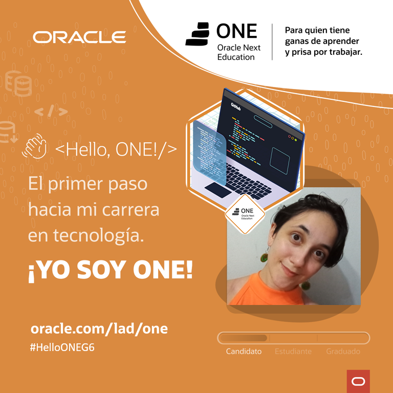

<h1>Challenge del Encriptador de Texto</h1>

Esta web permite ingresar un texto y encriptarlo o desencriptarlo, además de copiar el texto devuelto por el encriptador. 
Fue desarrollada como proyecto final de la Formación Principiante en Programación de #ONE (Oracle Next Education) y Alura, como parte del #G6. A partir del modelo ofrecido, se realizó un diseño propio, respetando la sencillez de su funcionamiento y las reglas de codificación.

 
<h2>Insignia de finalización de la Formación</h2>

Quiero compartir mi tarjeta de presentación de candidata ONE con la insignia recibida tras la entrega del encriptador.

